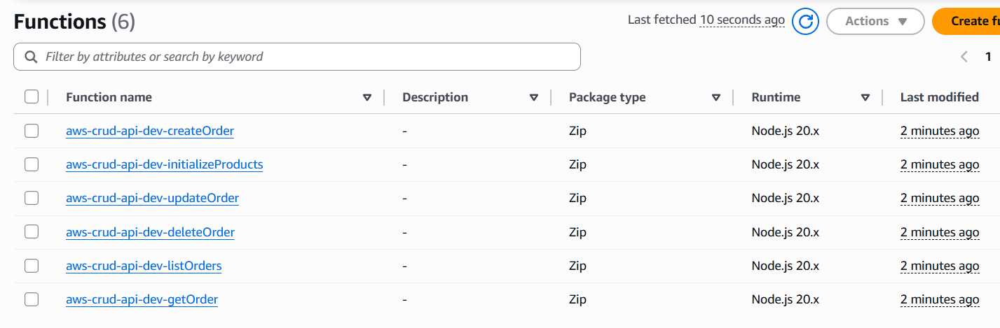
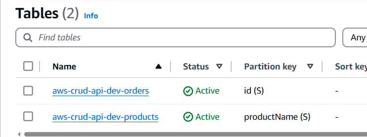
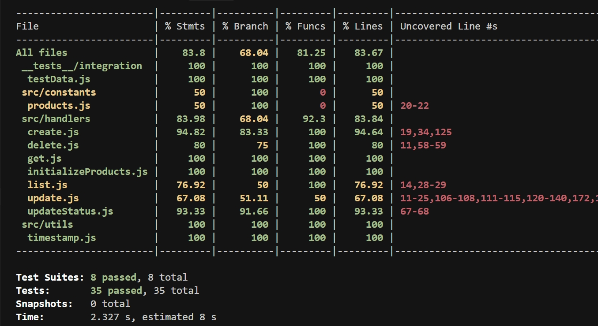
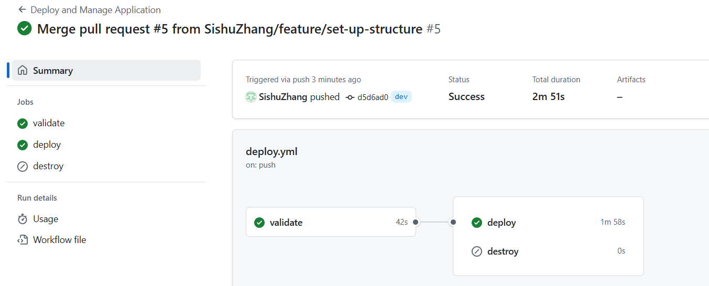
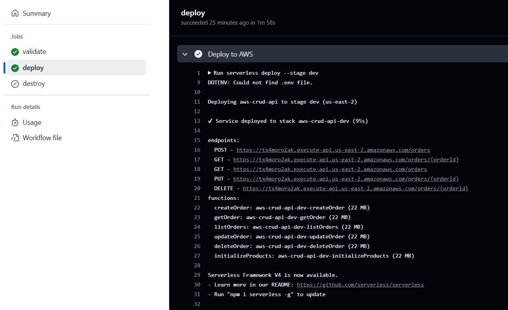
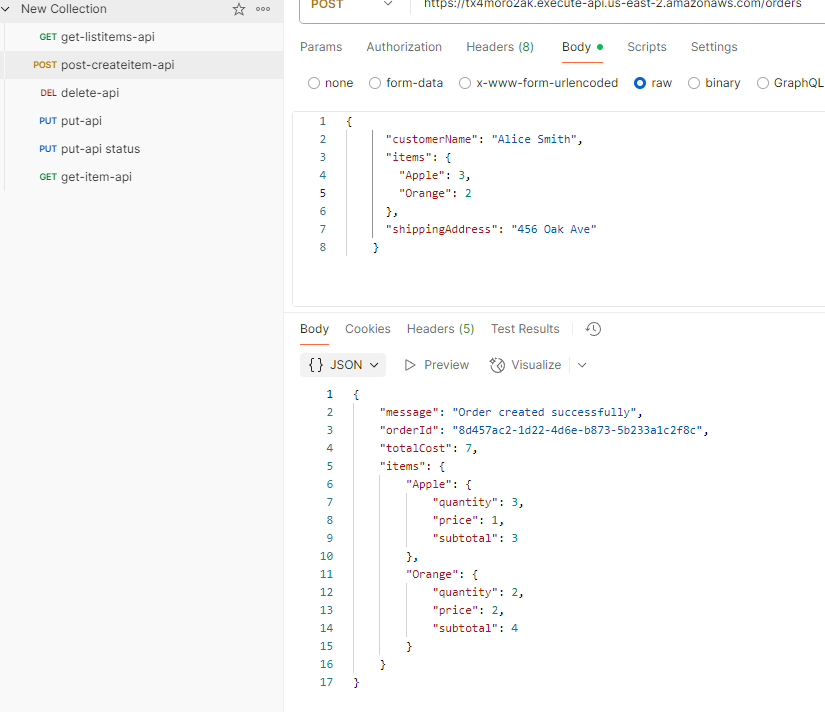
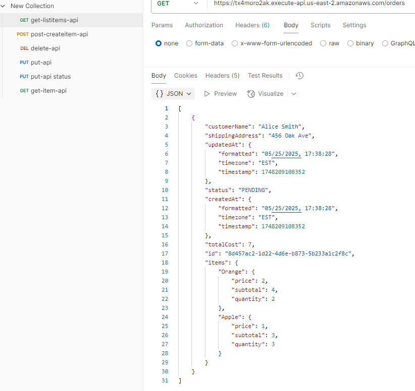
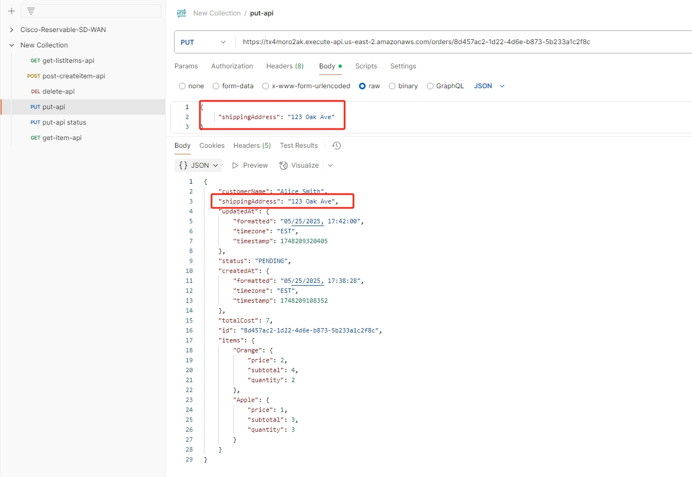
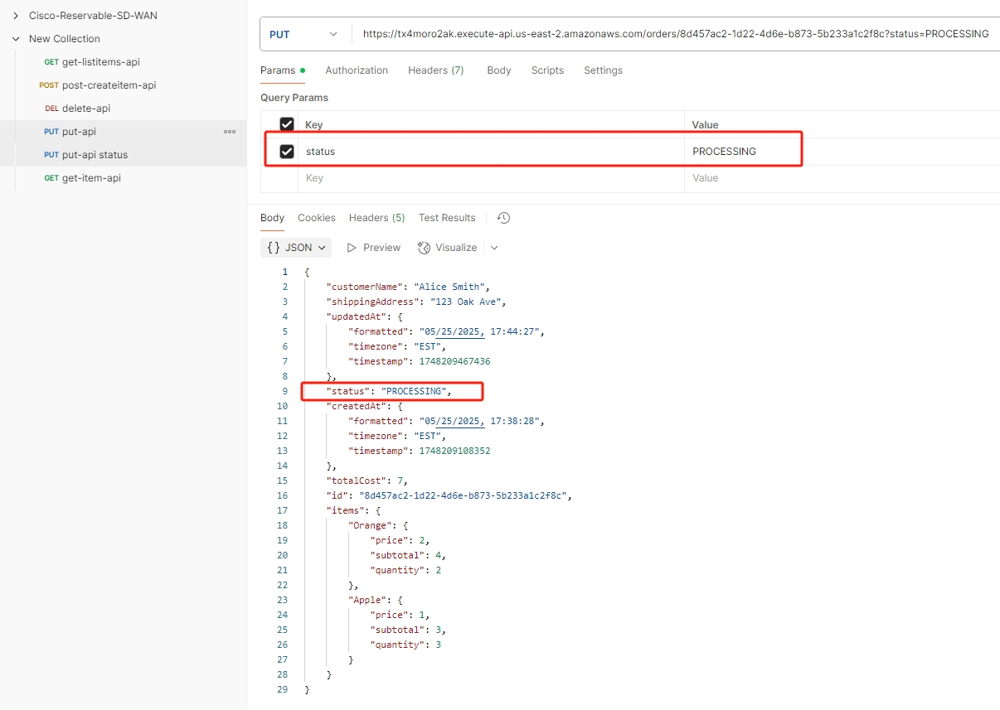
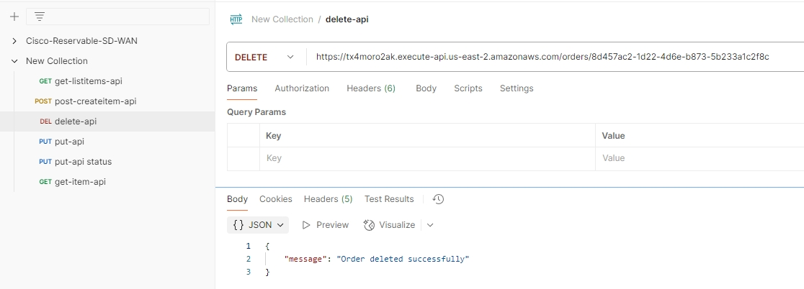

# AWS CRUD API (Serverless, Lambda, DynamoDB)

A robust, production-ready serverless CRUD API for managing customer orders, built with Node.js, AWS Lambda, API Gateway, DynamoDB, and the Serverless Framework. This project is designed to demonstrate best practices in serverless architecture, infrastructure-as-code, CI/CD automation, and automated testing. It is suitable for real-world use cases such as e-commerce order management, inventory systems, and more.

---

## Table of Contents
1. [Project Overview](#1-project-overview)
2. [Use Case Scenario](#2-use-case-scenario)
3. [Features](#3-features)
4. [Architecture Overview](#4-architecture-overview)
5. [Design Details](#5-design-details)
6. [Prerequisites](#6-prerequisites)
7. [Infrastructure Design](#7-infrastructure-design)
8. [Code Design](#8-code-design)
9. [Setup & Installation](#9-setup--installation)
10. [Testing](#10-testing)
11. [CI/CD & Automation](#11-cicd--automation)
12. [Deployment](#12-deployment)
13. [API Endpoints & Usage](#13-api-endpoints--usage)
14. [Cleanup](#14-cleanup)
15. [Future Expansion](#15-future-expansion)
16. [License](#16-license)

---

## 1. Project Overview
This repository contains a fully serverless CRUD API for managing customer orders. The solution leverages AWS Lambda for compute, DynamoDB for persistent storage, and API Gateway for HTTP endpoints. The Serverless Framework is used for infrastructure-as-code, making deployment and management seamless. The project is structured for scalability, maintainability, and ease of extension.

---

## 2. Use Case Scenario
Imagine a growing online shop that needs to manage customer orders, products, and order statuses efficiently. As the business scales, traditional server management becomes a bottleneck. By adopting a serverless architecture, the shop can:
- Automatically scale to handle traffic spikes
- Reduce operational overhead and costs
- Focus on business logic instead of infrastructure
- Rapidly deploy new features and fixes

This project provides a blueprint for such a transition, with a focus on real-world business logic, validation, and best practices.

---

## 3. Features
- **Full CRUD Operations**: Create, read, update, and delete customer orders
- **Product Catalog Initialization**: Easily populate the products table
- **Order Status Management**: Update and track order statuses
- **Robust Validation**: Input validation and error handling throughout
- **Infrastructure as Code**: All resources defined in `serverless.yml`
- **Automated Testing**: Unit and integration tests for all handlers
- **Local Development**: Emulate AWS services locally for rapid iteration
- **CI/CD Ready**: Easily integrate with GitHub Actions or other CI/CD tools

---

## 4. Architecture Overview
- **API Gateway**: Exposes RESTful HTTP endpoints for all CRUD operations
- **AWS Lambda**: Stateless compute for each API operation (one handler per operation)
- **DynamoDB**: Two tables—one for orders, one for products
- **CloudWatch**: Centralized logging and alarms for monitoring
- **Serverless Framework**: Manages deployment, configuration, and infrastructure


---

## 5. Design Details

### 5.1 IAM Policy & Least Privilege
- **Principle:** Each Lambda function is granted only the minimum permissions required to perform its task.
- **Implementation:**
  - The `serverless.yml` defines IAM roles and policies for each Lambda.
  - For example, the `initializeProducts` Lambda is only allowed `dynamodb:PutItem` and `dynamodb:BatchWriteItem` on the Products table, and has no access to the Orders table.
  - Order-related Lambdas (create, update, delete, get, list) have access only to the Orders table and, where needed, read access to the Products table for validation.
  - No Lambda has wildcard (`*`) permissions; all resources and actions are explicitly scoped.
- **Security:** This approach minimizes the blast radius in case of a compromise and follows AWS best practices for serverless security.

### 5.2 Lambda Functions: Brief Code Explanation
- **initializeProducts.js:**  Populates the Products table with initial product data. Reads from a local constant and writes each product to DynamoDB. Does not interact with the Orders table.
- **create.js:**  Validates and creates a new order. Checks product existence and price from the Products table, calculates totals, and writes the order to the Orders table.
- **get.js:**  Retrieves a single order by ID from the Orders table.
- **list.js:**  Lists all orders, with optional pagination, from the Orders table.
- **update.js:**  Updates order details (customer info, items, status). Revalidates items against the Products table and recalculates totals.
- **delete.js:**  Deletes an order by ID from the Orders table.

Each handler is a single-purpose Lambda, following the microservice principle and keeping business logic isolated and testable.

**AWS Lambda Console Example:**


**DynamoDB Table Example:**


### 5.3 Workflow Pipeline Design
- **CI/CD Pipeline (GitHub Actions):**
  - **Trigger:** On push to `dev`, `stg`, or `main` branches, or via manual dispatch.
  - **Jobs:**
    1. **Validate:**  Checks out code, installs dependencies, builds the project, runs all tests, and validates the Serverless configuration.
    2. **Deploy:**  If validation passes, configures AWS credentials using GitHub Secrets, then deploys the stack to AWS using the Serverless Framework.
    3. **Destroy:**  (Manual only) Removes the stack from AWS for the selected stage.
  - **Security:**  AWS credentials are never hardcoded; they are injected via GitHub Secrets. The pipeline enforces that only tested and validated code is deployed.
  - **Branch Strategy:**  Promotes code from feature branches to dev, stg, and main for progressive testing and deployment.

---

## 6. Prerequisites
- **Node.js** >= 20.x
- **npm** >= 8.x
- **AWS CLI** configured with access to your AWS account
- **Serverless Framework** globally installed (`npm install -g serverless`)
- (Optional) **Docker** for running DynamoDB locally
- (Optional) **GitHub Actions** or another CI/CD tool for automated deployment


---

## 7. Infrastructure Design
- **Orders Table**: DynamoDB table for customer orders (partition key: `id`)
- **Products Table**: DynamoDB table for product catalog (partition key: `productName`)
- **API Endpoints**: `/orders`, `/orders/{orderId}`
- **IAM Roles**: Lambda functions have least-privilege access to DynamoDB
- **CloudWatch**: Logs and alarms for observability
- **Plugins**: `serverless-offline` for local dev, `serverless-dotenv-plugin` for environment management


---

## 8. Code Design
- **src/handlers/**: Lambda functions for each API operation
  - `create.js`: Create a new order (validates input, enriches items, calculates totals)
  - `get.js`: Retrieve an order by ID
  - `list.js`: List all orders (supports pagination)
  - `update.js`: Update order details (supports partial updates, recalculates totals)
  - `delete.js`: Delete an order by ID
  - `initializeProducts.js`: Populate the products table with initial data
- **src/constants/products.js**: Defines the product catalog and utility functions
- **src/utils/**: Utility functions (e.g., timestamp formatting)
- **__tests__/**: Unit and integration tests for all handlers


---

## 9. Setup & Installation
1. **Clone the repository**
   ```bash
   git clone <your-repo-url>
   cd aws-crud-api
   ```
2. **Install dependencies**
   ```bash
   npm install
   ```
3. **Configure AWS credentials**
   Ensure your AWS CLI is configured (`aws configure`).


---

## 10. Testing
Automated tests ensure code quality and reliability.

- **Run all tests:**
  ```bash
  npm test
  ```
- **Run only unit tests:**
  ```bash
  npm run test:unit
  ```
- **Run only integration tests:**
  ```bash
  npm run test:integration
  ```
- **View coverage report:**
  ```bash
  npm run test:coverage
  ```

Test files are located in `__tests__/unit` and `__tests__/integration`.

**Test Coverage Example:**


---

## 11. CI/CD & Automation
Integrate with GitHub Actions or your preferred CI/CD tool for automated deployment and testing.

- **Recommended Branch Strategy:**
  - `main`: Production
  - `stg`: Development
  - `dev`: Development
  - Feature branches: `feature/xyz`
- **Typical Workflow:**
  1. Push changes to `feature/xyz` for local deployments
  2. Merge to `dev` for Dev testing deployments
  3. Merge to `stg` for QA testing deployments
  4. Merge to `main` for production deployments
- **GitHub Actions Example:**
  - Install dependencies
  - Run tests
  - Deploy to AWS using Serverless Framework
  - Use GitHub Secrets for AWS credentials and Serverless access key

**CI/CD Pipeline Example:**


---

## 12. Deployment
1. **Deploy to AWS:**
   ```bash
   npm run deploy
   # or
   serverless deploy
   ```
2. **Initialize the product catalog:**
   - After deployment, run the `initializeProducts` Lambda (via AWS Console or CLI) to populate the products table.
3. **Retrieve API Gateway URL:**
   - After deployment, note the API endpoint URL output by Serverless or in the AWS Console.

**Deployment Example:**


---

## 13. API Endpoints & Usage
- `POST   /orders` - Create a new order
- `GET    /orders/{orderId}` - Get order by ID
- `GET    /orders` - List all orders
- `PUT    /orders/{orderId}` - Update order details
- `PUT    /orders/{orderId}/status` - Update order status
- `DELETE /orders/{orderId}` - Delete an order

### Example Usage (with curl)
```bash
# Create an order
curl -X POST <API_URL>/orders -H 'Content-Type: application/json' -d '{"customerName":"John Doe","items":{"Apple":2},"shippingAddress":"123 Main St"}'

# Get an order
curl <API_URL>/orders/<orderId>

# List orders
curl <API_URL>/orders

# Update an order
curl -X PUT <API_URL>/orders/<orderId> -H 'Content-Type: application/json' -d '{"customerName":"Jane Doe"}'

# Update order status
curl -X PUT <API_URL>/orders/<orderId>/status -H 'Content-Type: application/json' -d '{"status":"SHIPPED"}'

# Delete an order
curl -X DELETE <API_URL>/orders/<orderId>
```

**Create Order Example:**


**List Orders Example:**


**Update Order Example:**


**Update Status Example:**


**Delete Order Example:**


---

## 14. Cleanup
To remove all deployed resources:
```bash
npm run remove
# or
serverless remove
```


---

## 15. Future Expansion

This project provides a solid foundation for a serverless CRUD API, but there are several areas for future enhancement to further improve security, scalability, and usability:

- **User Authentication with Amazon Cognito:**
  - Integrate Amazon Cognito to provide secure user sign-up, sign-in, and access control for API endpoints. This enables user-specific data access and supports OAuth, SAML, and social identity providers.

- **Web Application Firewall (WAF):**
  - Add AWS WAF in front of API Gateway to protect against common web exploits and bots, providing an additional layer of security for your API.

- **API Tracing with AWS X-Ray:**
  - Enable AWS X-Ray for Lambda functions and API Gateway to trace requests end-to-end, identify performance bottlenecks, and debug distributed systems more effectively.

- **Enhanced Table Design:**
  - Refine DynamoDB table schemas for scalability and query efficiency. Consider using composite keys, secondary indexes, and normalization/denormalization strategies to support more complex queries and relationships.

- **Custom Domain Name for API Gateway:**
  - Configure a custom domain name for your API Gateway, enabling branded URLs, HTTPS, and easier integration with frontend applications.

- **User Interface (Web Dashboard):**
  - Develop a user-friendly web dashboard for managing orders, products, and users. This UI could be built with React, Vue, or Angular, and integrate directly with the API for real-time management and analytics.

- **Predictive Analytics for Inventory and Demand Planning:**
  - Leverage collected order and product data to forecast inventory needs and plan for demand spikes. Integrate analytics dashboards and consider using machine learning models to optimize stock levels and improve business decision-making.

These enhancements will help transition the project from a robust prototype to a production-grade, enterprise-ready solution.

---

## 16. License
[MIT](LICENSE)
